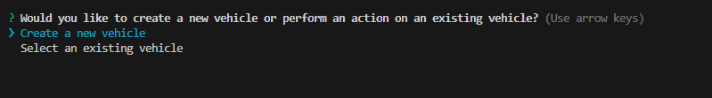
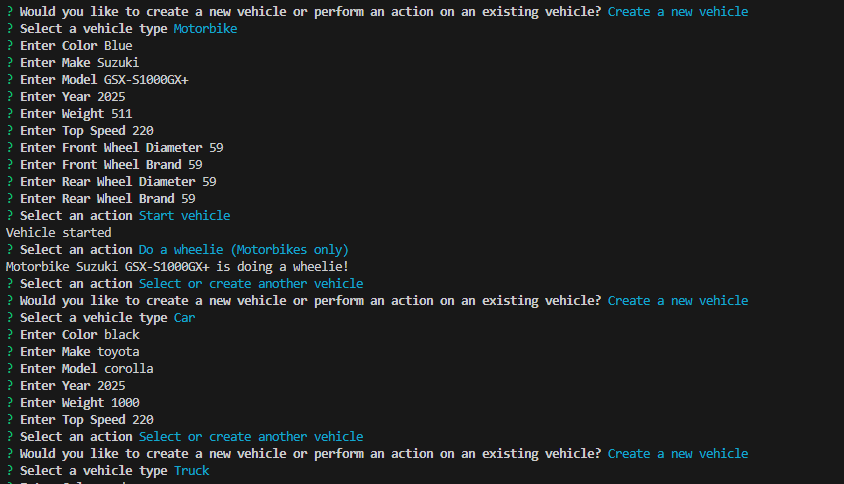
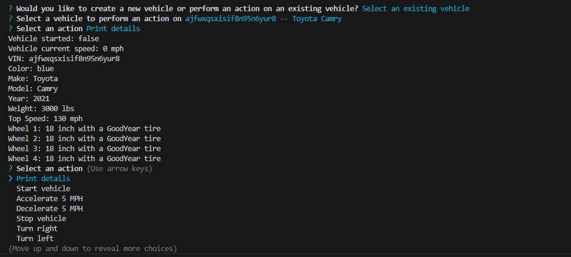

# WeatherDashboard

# ReadMe Generator

No license.

## Description

This project is a Typescript command-line application that allows the user to create, select, and store vehicles. The user is prompted with questions such as vehicle type, make, model, year, and so on. Additionally, the app allows to navigate if the truck needs to tow another vehicle, and if the motorbike is performing a wheelie.

## Table of Contents

- [Installation](#installation)
- [Usage](#usage)
- [Demo](#Demo)
- [License](#license)
- [Contributing](#contributing)
- [Tests](#tests)
- [Questions](#questions)

## Installation

To use this app, you will need to clone the repo to then be able to use the Vehicle Management CLI.

<h3>First, clone the repo:</h3>

```
git clone https://github.com/Michel-Gomes33/Vehicle-Builder
 ``` 

<h3>Second, you will need to install dependencies. Here, I'm working with NodeJS, and the command line is:</h3>

```
npm i
```
<h3>Finally, to launch the terminal app, run the start command: </h3>

```
npm run start
```


## Usage

The app allows the user to build or select existing vehicles. Additional menus are there to offer perform actions options.

Under building vehicle, the options are:
    - Car
    - Truck
    -Motorbike.
Under perform actions, some of the options are
    - start
    - accelerate
    - decelerate
    - stop
    - tow (exclusive to trucks)
    - do a wheelie (exclusive to motorbikes).
Finally, under build, there are additional questions such as make, model, color, year, weight, and tire diamater (for motorbikes).


## Demo

<h3>CLI Menu:</h3>



<h3>Build Options:</h3>



<h3>Print Details:</h3>



## License

N/A.

## Contributing

Make sure to cite my github

## Link to demo

https://app.screencastify.com/v3/watch/B0G3bJ5V5zvAruIvZcgW

## Questions

For any questions, please contact me at [N/A](mailto:N/A).

Check out my GitHub profile: [Michel-Gomes33](https://github.com/Michel-Gomes33)
    